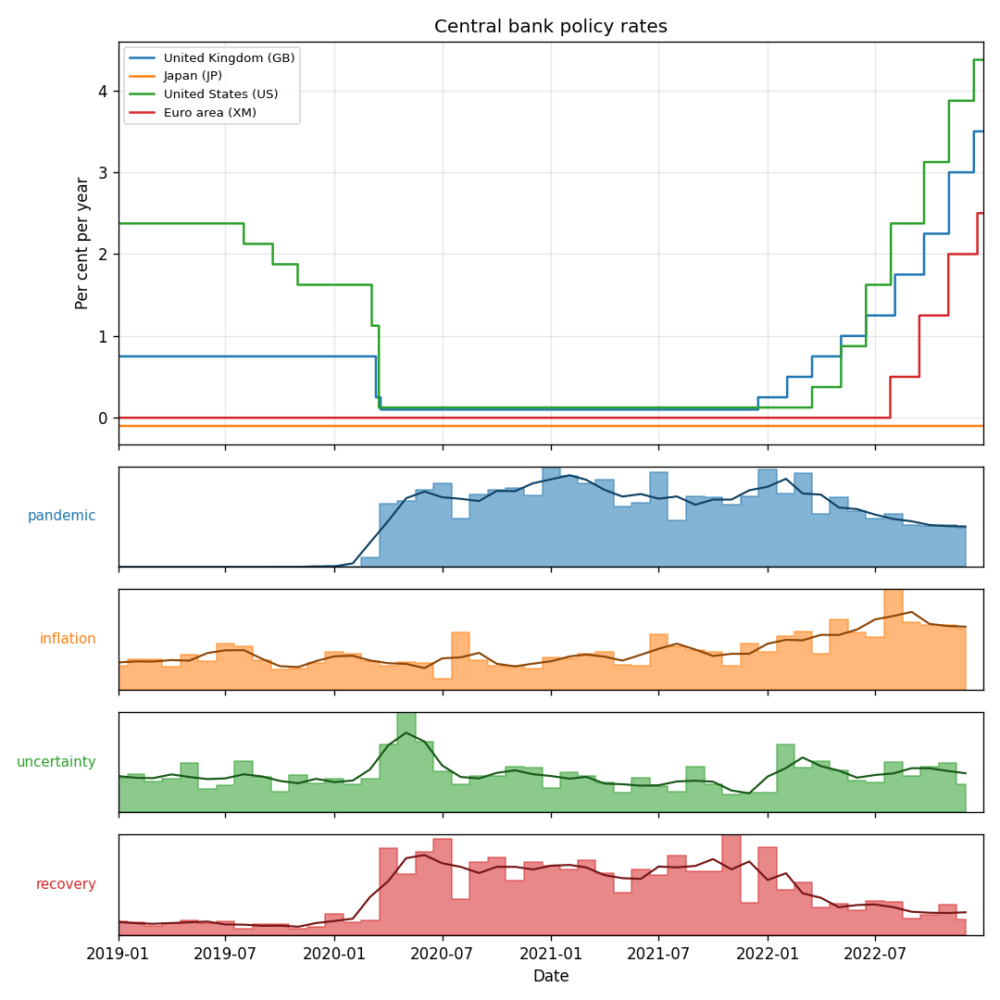

# BIS Policy Rate Monitor (Python)

[](https://github.com/darrenproton/Policy-Rate-Monitor-PYTHON/actions/workflows/cross-check.yml)

> **Cross-implementation check:** a GitHub Action runs this Python CLI, the
> [Bash port](https://github.com/darrenproton/Policy-Rate-Monitor-BASH) and the live web app over
> identical date ranges off the same dataset and verifies they produce the **same** latest rate and
> last move for every country. Open the latest
> [run's summary](https://github.com/darrenproton/Policy-Rate-Monitor-PYTHON/actions/workflows/cross-check.yml)
> for the comparison tables.

A command-line tool that discovers, downloads and tidies the BIS *Central bank policy rates*
dataset, then produces a latest-snapshot report — table, chart, and a self-documenting `report.md`
— for a chosen set of countries. It also ships both optional extensions from the brief: SDMX
codelist validation, and a central-bank **speeches** term analysis.



*Example output (`--with-speeches`): policy rates on top; below, how often chosen terms appear in
central-bank speeches, per 1,000 words, aligned to the same timeline. See the
[journey addendum](addendum-readme.md) for the full story behind these graphs.*

## How it meets the brief

| Brief deliverable | Where |
|---|---|
| Source-code package | `src/bis_prates/` (`fetch`, `parse`, `transform`, `report`, `codelists`, `speeches`, `cli`) |
| `out/summary.csv`, `out/summary.json` | snapshot per country, **enriched** with attributes (decimals, unit, multiplier, title, source, active definition) |
| `out/policy_rates.png` | step chart + definition-break markers (and speech lanes with `--with-speeches`) |
| `out/report.md` | snapshot table, chart, series definitions & notes, speeches + lead/lag, provenance footer |
| ≥ 3 unit tests (parsing, change-calc, dedupe) | `tests/` — 39 tests (incl. those three) |
| CLI (Option A) | `bis-prates fetch` / `transform` / `report` |
| AI-usage note | bottom of this file |
| Extension 1 — SDMX metadata | country codes validated against `CL_BIS_GL_REF_AREA` via `pysdmx` |
| Extension 2 — speeches NLP | `--with-speeches` (via `gingado`) — discovery, normalisation, lead/lag |

## Install

```bash
cd PYTHON
python -m venv .venv && source .venv/bin/activate
pip install -e .            # add ".[speeches]" for Extension 2, ".[dev]" for the tests
```

This exposes the `bis-prates` command.

## Usage

Three steps: **fetch → transform → report**.

```bash
bis-prates fetch                                  # download + cache the bulk CSV (verified via SDMX)
bis-prates transform                              # parse + tidy (prints a summary)
bis-prates report --countries "US,XM,GB,JP,CH" --start 2015-01-01
```

### `report` options

| Option | Description |
|--------|-------------|
| `--countries` | Comma-separated REF_AREA codes. **Euro area is `XM`** (not `EA`); codes are validated against the official SDMX codelist, with did-you-mean suggestions. |
| `--start` / `--end` | Window bounds, `YYYY-MM-DD`. `--end` also takes the snapshot *as of* that date. |
| `--out` / `--label` | Output folder / filename prefix (to keep variants side by side). |
| `--with-speeches` | Add the speech term-frequency panel (needs the `speeches` extra). |
| `--terms "a,b,c"` | Curate the speech terms; omit to **auto-discover** them from the text. |
| `--smooth / --no-smooth`, `--smooth-window N` | Trend line over the speech lanes, and its window in months. |
| `--refresh-codelist` | Re-fetch the SDMX area codelist instead of using the cache. |
| `fetch --force` | Re-download even if cached. |

## Outputs

Written to `out/` (these are the brief's deliverables):

- **`summary.csv` / `summary.json`** — snapshot per country (latest rate, last change + date)
  enriched with the SDMX attributes.
- **`policy_rates.png`** — step chart (correct for forward-filled rates), definition-break markers,
  and stacked speech-term lanes when `--with-speeches`.
- **`report.md`** — snapshot table, the chart, series definitions & notes, the speeches section
  (+ lead/lag finding), and a provenance footer (source URL, timestamps, size, SHA-256).

## Extensions

- **SDMX codelist validation** — country codes are checked against the authoritative BIS SDMX
  codelist (`CL_BIS_GL_REF_AREA`) via `pysdmx`, cached locally, falling back to the dataset's own
  codes when offline.
- **Central-bank speeches** — `--with-speeches` pulls the BIS speeches corpus (via `gingado`),
  **discovers** the interesting words (or tracks `--terms`), charts them per 1,000 words aligned to
  the rates, and reports a **lead/lag** correlation against rate changes. The design — including the
  dead-ends and the reasoning that fixed them — is in **[addendum-readme.md](addendum-readme.md)**.

## Notes on the data (why the code is shaped the way it is)

- The BIS flat CSV uses **selective RFC-4180 quoting** (commas inside quoted fields), so it must be
  read with a quote-aware parser, not split on `,`.
- Each coded cell is `CODE: Label`; daily and monthly series mix `YYYY-MM-DD` and `YYYY-MM`.
- Daily series are **forward-filled** (a rate repeats until it changes), so dedupe and "last move"
  operate on **change-points**.
- Missing observations are flagged `OBS_STATUS=M` with `OBS_VALUE="NaN"`.

## Data source

BIS Data Portal — *Central bank policy rates*, bulk flat CSV:
<https://data.bis.org/static/bulk/WS_CBPOL_csv_flat.zip> (topic: <https://data.bis.org/topics/CBPOL>).
Downloads are cached in `data/` (gitignored).

## Development

```bash
pip install -e ".[dev]"
pytest             # 39 unit tests: parsing, change-calc, dedupe, codelists, report, fetch, speeches
flake8 src tests
```

## AI usage note

I architected the tool myself — the `fetch → transform → report` pipeline, the module boundaries,
and the data decisions — and used AI assistance in escalating layers as the work got harder. Early
on I used **VS Code Copilot** for the mechanical parts: generating the boilerplate folder/file
scaffolding and writing commit messages from the staged diffs. As the feature set grew I brought in
**Claude Sonnet** to help build out individual features against my design. By the time I was in the
weeds on the optional extensions — especially Extension 2 (the speeches term analysis) — I worked
with **Claude Opus as a pair programmer** to hash out ideas and refine the approach (the dead-ends
and reasoning are documented in [addendum-readme.md](addendum-readme.md)).

What was generated vs modified: Copilot's scaffolding and commit messages I reviewed and edited;
feature code drafted with the assistants I treated as a starting point — reviewed, reshaped to fit
the architecture, and covered with tests. The AI was never the last word. **One bug I caught from
AI output:** the obvious way to read the dataset is to split each line on commas, and that's what an
assistant first reached for — but the BIS flat CSV uses selective RFC-4180 quoting, so commas inside
quoted fields silently corrupt the columns. I caught it with a field-count sanity check (rows
carried 18–29 fields, not a constant 18) and switched to a quote-aware reader. A second instance:
the first "discover interesting words" attempt used TF-IDF, which rewards rarity and surfaced
bank-specific jargon (CNB, rupiah) rather than macro themes — I spotted it by reading the output,
reasoned about *why*, and replaced it with a mid-frequency + temporal-variability approach.
