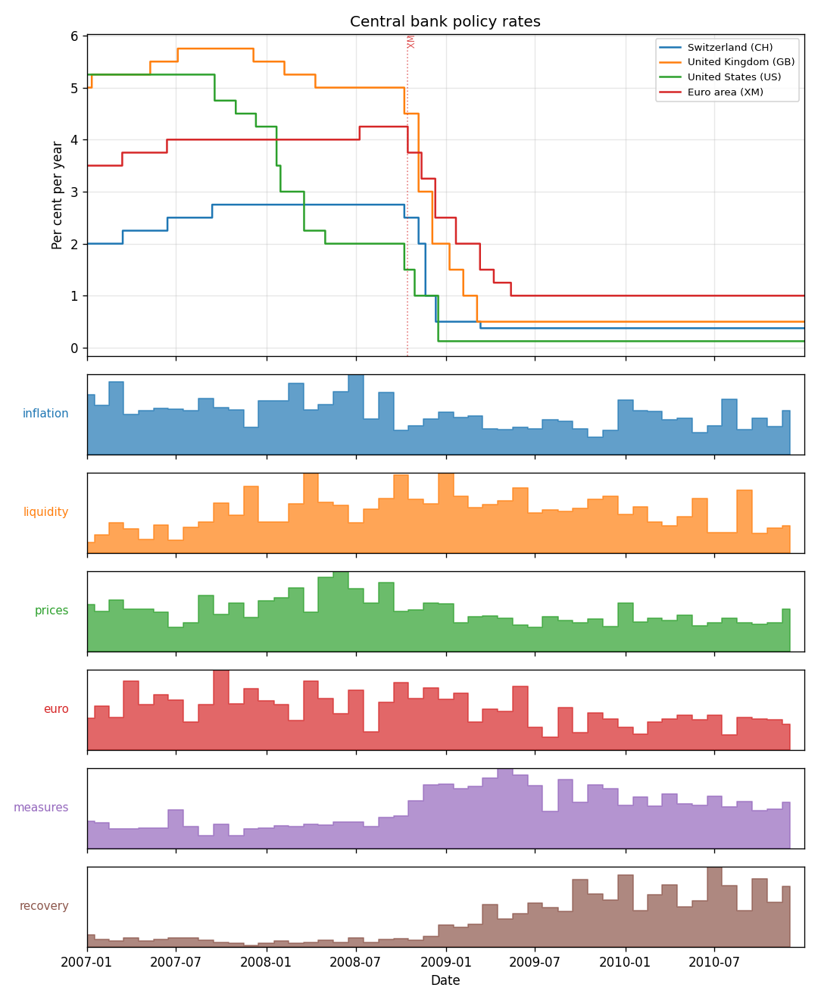
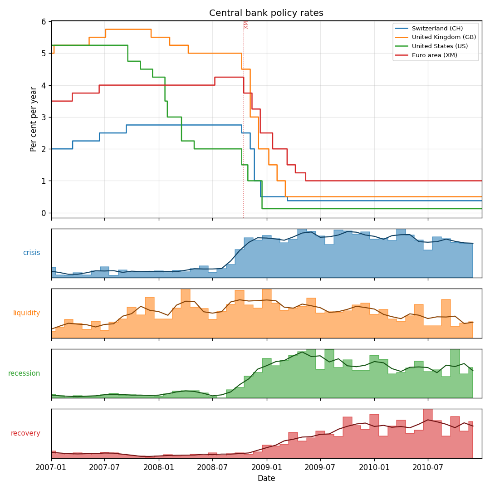
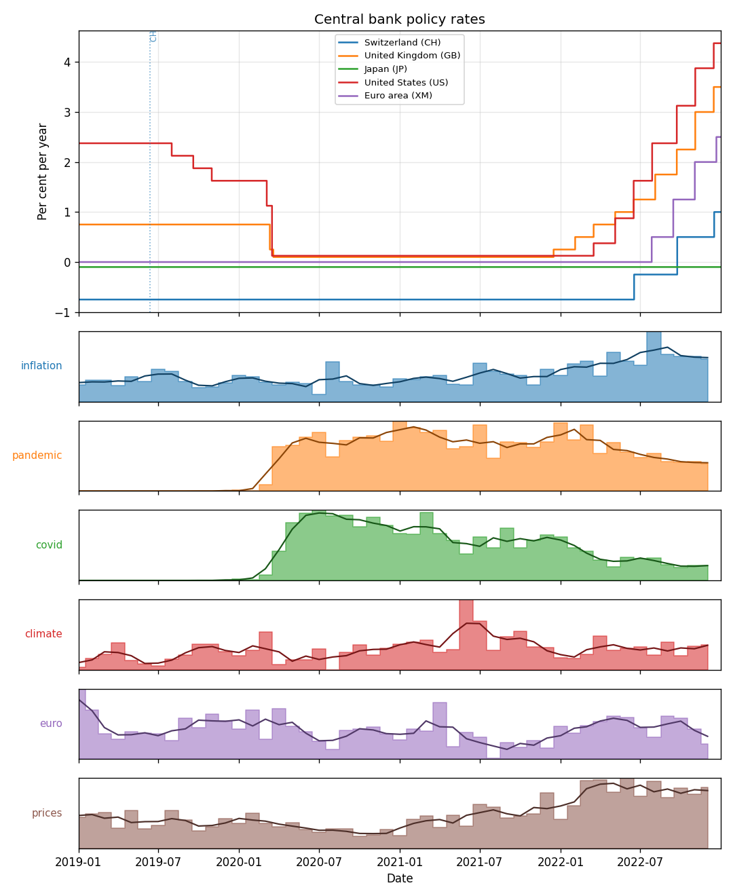
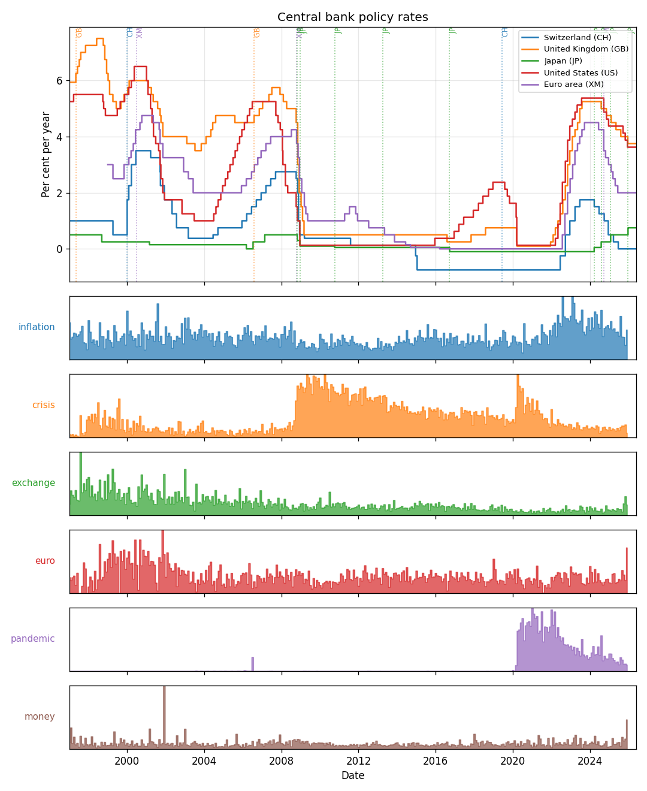
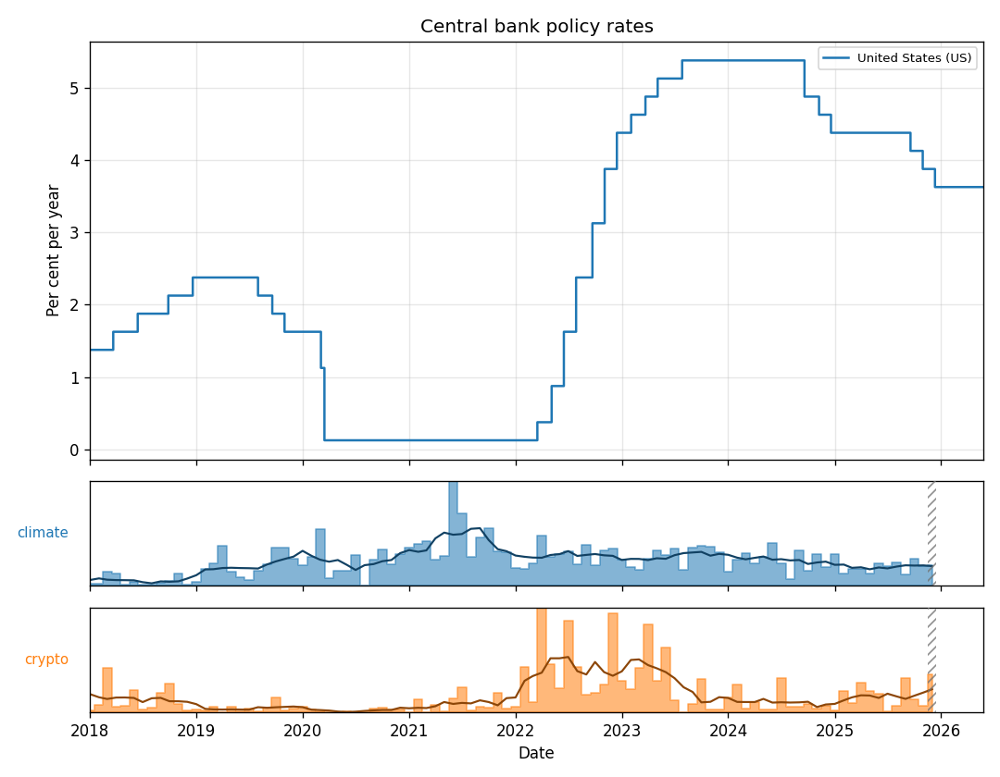

# Addendum — How the speech graphs were built (the Stage 9 journey)

This is the story behind the "speeches vs policy rates" graphs (Exercise Extension 2). It's
deliberately a *journey*: the interesting part isn't the final code, it's the dead-ends and the
reasoning that got us out of them. Every image referenced lives in
[out/speech-testing/](out/speech-testing/).

> Companion to the main project README. If you only read one thing: the discovery method went
> through **three** versions before it produced meaningful words, and each failure taught us
> something specific about the data.

---

## The goal

The brief's Extension 2: pull BIS central-bank speeches (via the `gingado` library), *"compute
frequency of terms like inflation, rate, tightening"*, and compare that with observed policy-rate
moves. The data: `gingado.datasets.load_CB_speeches(year)` → `[date, text, author, …]`, ~800
speeches/year, **1997 onwards**.

We render it as **stacked, time-aligned lanes** under the rate chart: rates on top, one
colour-coded lane per term below, sharing the x-axis so rhetoric lines up with rate moves.

---

## The journey (three versions of "which words?")

### v1 — count a fixed word list ❌
Counting `inflation/rate/tightening` per month seemed obvious. But the peaks were meaningless —
**every** term peaked in the same month. We were measuring *how much central bankers talked*
(speech volume), not *what they talked about*. Two fixes fell out of this:
- **Normalise:** mentions **per 1,000 words**, not raw counts, so a busy speech-month stops
  dominating.
- We still wanted to *discover* the words, not guess them.

### v2 — TF-IDF discovery ❌
TF-IDF is the textbook "what's distinctive about this slice" tool. We made each month a document
and took its top-TF-IDF words. Result:

> discovered terms: **cnb, ipom, fis, rmb, rupiah, ibc**

TF-IDF rewards **rarity**, so it surfaced *bank-specific jargon* — Czech National Bank, Chile's
IPoM report, the renminbi, the rupiah. Distinctive ≠ interesting.

### v3 — mid-frequency movers ✅
The insight: an *interesting* macro word is **common enough to be shared vocabulary, but whose
usage moves over time**. So:
- keep the **mid-frequency band** (words in 10–60 % of speeches — drops one-bank jargon *and*
  ubiquitous boilerplate like "bank"/"policy");
- rank by **temporal variability** (std of each word's monthly share).

With no input, that discovers:

> inflation, money, euro, digital, payments, trade

— recovering the canonical `inflation` data-drivenly *and* surfacing real 2024–25 themes (digital
/ payments / trade). (`scikit-learn`'s `CountVectorizer` does the heavy lifting; it ships with
`gingado`.)

### Then: a quantified finding (lead/lag)
A plain correlation says "they move together"; **lead/lag** asks "does one move *first*?" We
correlate each term's monthly series against monthly **rate *changes*** at offsets −6…+6 months;
the best offset says whether rhetoric **leads** or **lags** the rate move. e.g. for COVID:

> **prices leads US rate changes by 3 months (r = +0.57)** — price-talk before the hikes.

Reported as a small table + one finding sentence, with the honest caveats up front (speeches are
*global* while a rate is *one country*; many offsets are tested → exploratory).

### And: honesty about the edge
An open-ended ("to now") report's **final month is incomplete** — few speeches yet, so the
per-1,000-words rate spikes on a tiny denominator. We **hatch** that month on the chart, **footnote**
it, and **exclude** it from the lead/lag. Historical (`--end`) windows aren't marked — those months
are complete.

### And: a readable trend
The monthly bars are jittery, so each lane also draws a **centred moving-average trend line** (in a
darker shade) that cuts the noise and makes the shape — the crypto hump, the crisis spike — pop. A
*straight* best-fit line was rejected on purpose: these series aren't linear, so it would flatten
the very humps we want to see. Tunable: `--no-smooth` to drop it, `--smooth-window N` for the months.

### Two modes
- **Discover** (default): the data picks the words.
- **`--terms "a,b,c,d"`**: you curate them. When supplied, the report honestly says *"Requested
  terms tracked"* rather than *"discovered"*.

---

## The render harness

To A/B parameter tweaks and compare code versions, the app takes:
- `--out <dir>` — output folder, and
- `--label <prefix>` — filename prefix (`gfc-2008_policy_rates.png`).

So many variants sit side by side in one folder. Everything below is in
`out/speech-testing/`.

---

## The gallery (with commentary)

A few outputs that show the method earning its keep. All are reproducible (see below).

### Discovery on a crisis — the 2008 GFC



With **no term list**, discovery surfaced `inflation, liquidity, prices, euro, measures, recovery`
— the GFC lexicon, found from the text alone. As rates collapse to zero in late 2008, `liquidity`
and `measures` (the emergency-facility vocabulary) surge, and `recovery` climbs into 2009–10. The
point: the words weren't chosen by me; the *data* picked the ones that move, and they happen to be
exactly the right ones.

### The same crisis, curated + trend line



Feed it the curated terms `crisis, liquidity, recession, recovery` and turn on the 3-month trend
line, and the sequence is unmistakable: **`crisis` at Lehman → `recession` through 2009 →
`recovery` into 2010**. Compare with the discovery chart above — discovery finds *what* mattered;
curation lets you *frame a thesis*. The trend line (darker, over the bars) is what makes the
hand-off legible; the raw monthly bars alone are too jittery to read.

### COVID — discovery + a quantified finding



Discovery found `pandemic` and `covid` — words that are **flat-zero before 2020 and switch on at
the shock**, a near-perfect natural step-change (they didn't exist in central-bank speech before).
The report's lead/lag table then quantifies the rhetoric-vs-action link (e.g. *prices leads US rate
changes by ~3 months, r ≈ +0.57*).

### COVID — curated


The curated cut: **`uncertainty` spikes at the March-2020 shock → `pandemic` sustained → `recovery`
mid-2020 → `inflation` surges late-2022** as the hikes begin. The trend lines trace each regime
cleanly through the monthly noise.

### Thirty years in one frame



Discovery over the **whole speech corpus (1997–2026)** surfaces a history of preoccupations:
the `exchange`-rate era of the early 2000s → `crisis` (2008) → `pandemic` (2020). The `pandemic`
lane is the giveaway — zero for two decades, then a clean block: a vocabulary that simply didn't
exist until it had to.

### Smoothing harder



The same modern themes with `--smooth-window 6`. Heavier smoothing trades month-to-month detail
for shape: the **crypto boom-and-bust (2021–23)** and the **CBDC peak (~2021)** read as clean
humps. This is the knob in action — 3 months preserves detail, 6 emphasises the arc.

> Also in the folder: `eurocrisis-terms` (ECB's 2011 hike-then-reverse, `greece` spiking mid-2011),
> `hiking-terms` (the `tightening/hike → cut` hand-off), and `seventies-baseline` — the honest
> limit, **rates only, empty speech panel**, because the corpus starts in 1997.

---

## Caveats (stated, not hidden)
- Speeches are **global** (all central banks); a policy rate is **one country** — so the lead/lag
  is exploratory. The clean version would pair a bank's *own* speeches with its *own* rate.
- Testing many offsets × terms inflates false positives — we report one pre-chosen pairing and
  flag it.
- The speech corpus starts in **1997**; earlier windows have no text panel.
- Mention frequency is a blunt proxy for *sentiment* — "cut" appears whether arguing for or against.

---

## Reproduce

```bash
source .venv/bin/activate
# discovery (default):
bis-prates report --start 2024-01-01 --with-speeches
# curated terms + labelled output:
bis-prates report --start 2007-01-01 --end 2010-12-31 \
  --with-speeches --terms "crisis,liquidity,recession,recovery" \
  --out out/speech-testing --label gfc-terms
# turn the trend line off, or smooth harder:
bis-prates report --start 2018-01-01 --with-speeches --no-smooth
bis-prates report --start 2018-01-01 --with-speeches --smooth-window 6
```

First run downloads + caches the speech years; later runs are fast. `gingado` is an optional
extra: `pip install -e ".[speeches]"`.
