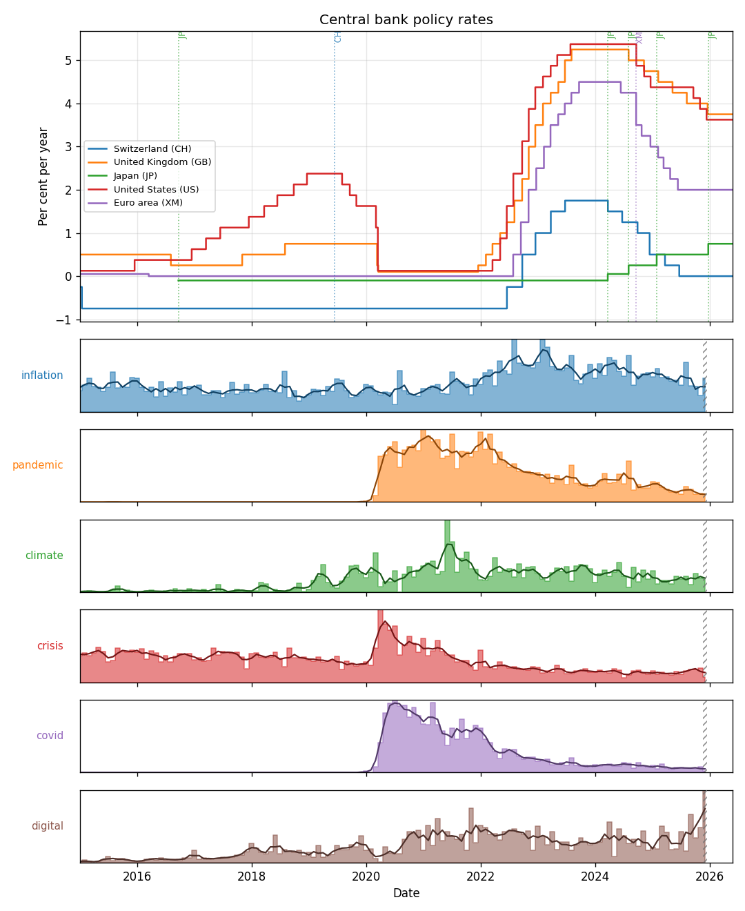

# BIS Policy Rate Monitor

Latest central bank policy-rate snapshot (from 2015-01-01). Unit: Per cent per year.

## Snapshot

| Country | Rate (%) | As of | Last change | Change (pp) |
|---|---:|---|---|---:|
| United States (US) | 3.625 | 2026-05-26 | 2025-12-11 | -0.250 (down) |
| Euro area (XM) | 2.000 | 2026-05-26 | 2025-06-11 | -0.250 (down) |
| United Kingdom (GB) | 3.750 | 2026-05-22 | 2025-12-18 | -0.250 (down) |
| Japan (JP) | 0.750 | 2026-05-26 | 2025-12-22 | +0.250 (up) |
| Switzerland (CH) | 0.000 | 2026-05-26 | 2025-06-20 | -0.250 (down) |

## Policy rates over time

## Series definitions & notes (in force during the report window)

**United States (US)** — source: US Federal Reserve System.
  - from 1985-12-19 onwards: mid-point of the Federal Reserve target rate

**Euro area (XM)** — source: European Central Bank.
  - from 2008-10-15 to 2024-09-17: official central bank liquidity providing, main refinancing operations, fixed rate
  - from 2024-09-18 onwards: official central bank steering rate is the deposit facility rate, fixed rate

**United Kingdom (GB)** — source: Bank of England.
  - from 2006-08-03 onwards: official bank rate

**Japan (JP)** — source: Bank of Japan.
  - from 2013-04-04 to 2016-09-20: no policy rate
  - from 2016-09-21 to 2024-03-20: the BOJ set the guideline for market operations which specifies a short-term policy interest rate at minus 0.1% and a target level of 10-year JGB yields at around 0%. Short-term policy interest rate
  - from 2024-03-21 onwards: to 31 July: the BOJ encouraged the UOCR to remain at around 0 to 0.1 %
  - from 2024-08-01 to 2025-01-26: the BOJ encouraged the UOCR to remain at around 0.25%
  - from 2025-01-27 to 2025-12-21: the BOJ encourages the uncollateralized overnight call rate to remain at around 0.50 percent
  - from 2025-12-22 onwards: the BOJ encourages the uncollateralized overnight call rate to remain at around 0.75 percent
  - Note: For details see: http://www.bis.org/statistics/cbpol/cbpol_doc.pdf  ; https://www.boj.or.jp/en/mopo/mpmdeci/mpr_1998/k980909c.htm ; https://www.boj.or.jp/en/mopo/mpmdeci/mpr_1999/k990212c.htm ; https://www.boj.or.jp/en/mopo/mpmdeci/mpr_2000/k000811.htm ; https://www.boj.or.jp/en/mopo/mpmdeci/mpr_2001/k010228a.htm ; https://www.boj.or.jp/en/mopo/mpmdeci/mpr_2006/k060309.htm ; https://www.boj.or.jp/en/mopo/mpmdeci/mpr_2006/k060714.pdf ; https://www.boj.or.jp/en/mopo/mpmdeci/mpr_2007/k070221.pdf ; https://www.boj.or.jp/en/mopo/mpmdeci/mpr_2008/k081031.pdf ; https://www.boj.or.jp/en/mopo/mpmdeci/mpr_2008/k081219.pdf ; https://www.boj.or.jp/en/mopo/mpmdeci/mpr_2010/k101005.pdf ; https://www.boj.or.jp/en/mopo/mpmdeci/mpr_2016/k160921a.pdf ; https://www.boj.or.jp/en/mopo/mpmdeci/mpr_2024/k240319a.pdf ; https://www.boj.or.jp/en/mopo/mpmdeci/mpr_2024/mpr240731c.pdf ; https://www.boj.or.jp/en/mopo/mpmdeci/mpr_2025/mpr250124a.pdf ; https://www.boj.or.jp/en/mopo/mpmdeci/mpr_2025/k251219a.pdf

**Switzerland (CH)** — source: Swiss National Bank.
  - from 2000-01-01 to 2019-06-12: mid-point of the SNB target range
  - from 2019-06-13 onwards: SNB Policy rate

## Central-bank speeches - term frequency

Interesting words discovered from BIS central-bank speeches (via gingado), shown as mentions per 1,000 words so
speech volume doesn't dominate, aligned to the rate chart above. Watch the rhetoric
tracks turn around the policy-rate moves.

| Term | Peak month | Peak (per 1k words) |
|---|---|---:|
| inflation | 2022-08 | 8.71 |
| pandemic | 2021-01 | 2.92 |
| climate | 2021-06 | 3.98 |
| crisis | 2020-04 | 4.05 |
| covid | 2020-07 | 2.18 |
| digital | 2025-12 | 3.27 |

> The final month (2025-12) is **incomplete** (few
> speeches so far); it is hatched on the chart and excluded from the lead/lag below.

### Lead/lag vs US policy-rate changes

Correlation of each term's monthly frequency with monthly rate *changes*, at the
best offset. Positive lag = the term **leads** the rate move. Exploratory - speeches
are global while the rate is one country, and many offsets are tested.

| Term | Lead/lag (months) | Correlation |
|---|---:|---:|
| inflation | -2 (lags) | +0.34 |
| pandemic | +6 (leads) | +0.27 |
| climate | -5 (lags) | +0.09 |
| crisis | -1 (lags) | -0.29 |
| covid | -6 (lags) | -0.20 |
| digital | +4 (leads) | +0.21 |

**Finding:** *inflation* lags US rate changes by 2 month(s) (r = +0.34).

## Data provenance

- Dataset: WS_CBPOL v1.0 (https://data.bis.org/static/bulk/WS_CBPOL_csv_flat.zip)
- Title: Central bank policy rates
- Downloaded: 2026-06-03T19:43:04+00:00
- Last-Modified: Wed, 27 May 2026 14:33:36 GMT
- Size: 4077523 bytes
- SHA-256: `03b8a1ffbf08411ac5869869dd012e009ba4b1c0192365d1e3136e0dc81a1852`
